# Metabuilder diagram for Records in Contexts parser for draw.io

[Online Mermaid Diagram on Kroki](https://kroki.io/mermaid/svg/eNqdV1tvozgUfu-vsDrSaFdqu3NRRtM-rMQQN0VDGwRMt120sgiYxDsERwbaZtQfv8c2EG5J200klOBzP9-5eCnCzQr5344QfPJysVT_HRcHx_A4ddy5iT3Pupkh58rw8PE_ilB-YiZoVDCe1dzyc3dtE-smcMNHNBXh4xnj8tWOqfnRqJIcSt3TOj1b0yKMwyI82wjaUiU_-M53DdMPCH0qRBgVJAb5jJOapUvt-a7lBCQvBNs0JKTMqSB88S_YvSOnWXzAPOvGJ9fYN7SNLCuoyMKDhk7xpfHD9r3A5FlehFmRo_doSpOwTIu8SzrDvo9dL1jSgvCs4ClfbgkT7ATJNyA6YU8niBbRWZfPv3ewF_jbDUVGysKc5m9xx_Rdu-dOBNoFT0e8MdyZY7geDkgoluWagjtkEwoI5GtVutNLMjXqCIo4OdsTOBlm88pwg2sIbrQKZZapQKswi1OWLbvEpuF45hW-xoEZblgRpuxXqMCYRyu6fn1ApHW7gEjr9sfi1rAt8ARioSJAokpzrjQTrfkFxbpA0OnpnzWij3oIV2fPOvk0P0ELyC8pJSii_AE0F6tnDe-jDtg1W5TSMKOxVPMsH-Yc3PI5MrmgI1VYY1Uxy_jLRKn4yxwhh_N0x6VQ16E86gF5_LCGkLZQ1iCCGCds-TykrTEwLqlOwPC0jnW3jSnvj-UTvbaRHSgZLW1QMxEfAGXuAjQhK4Y_dwOyKFkaEyWMJIKvCTQuAt2uy2PdTK1b8s2em9-9gGUxe2BxGaZkkfLo56vhLOGlik0bK3uqqrYRI3du227noBFm45lh3gfHNl2G0RbZfMki9JtXbiigP6bx7z2JirnYprTiRAlL04t3yUR-T6AX85_04t05ld_q7-kji4vVxafNU_0iDnMofRFuL9AETQbyfRfjQI4Waw6--oLSoQ0zPAdwuPfBjHJo1GKLojCNylSVaT6kN7FtQ7umaYpYDB2OJSxStENSw3Xnf3mBIQR_RLILDBrTLpdA20pkTqCPQRMFxhyBVSsedxnbie0kt9uv8K3l4Wlw7NIHBlnQWdmbiIq8ygT9nHxK4iYTHydfJtGHQSaGopp6sg0ooUsLu1UKZMzMNMxzCFl7IozjrLUn9MNPlGidg1rgvhxUKYaOPb_bpfg9cgR_YmtWbMdZVOqIi-vsuTTnablfBbZhukDtz_BNMFPu45TKAYhmNKNij3H9LLb_vzyaW6Xb9Jl99atAFlgNwFAk49af3m7l7cjhLXaty_uAPFDBEtg7ciJYRMakTKey98MKEMek1ZoKWEDevAVo75o1YMQxSYrvTOz4Afw8FRQKF4BOnyK66VXwK2f7TueBpj1zDefKhEagoe2oJUcnfiQmHgQPptHfOAAqJpcASgquu_zLK4AaSXKItSdFZwjKWO2nOBqbNHq-Mr10MohZjh5ZsWqG7a56G_bdK828Q9MfGjZaWkTz5zcbsoGYgQmNBKjQ2pL2rBuKap9qUXoGniBY3WEr5hv4qfZ59ft_W6altsxqcjoU0hxpCUOI1G4-axzNf_hy7XJ4Xt00xhcUZ-75cNGC55tvWod2eyV1uNyDMT3Me9Pvgd5lq9vUEMIaJlZARJmdoHXIshfgXfuvIgUKxg9A5FHLCg31H74DcbtkYDWal8WmbF3TgKFFNBJTNe9gi69n3UfYOpLWkaq5aiNJknP6sc0GEav5viYTet46qy6o1fHiM50kUeu4fUGsaKKv9Et03qOpLxn7aNrXpNrMr4tF_KFH05MzoOlsgIeM7hPtt_oQUaevv2j3IaIOfDvq_gM-gYi4)

Metabuilder Python module: [drawio_meta_builder.py](drawio_meta_builder.py)

---

Source chat for diagram: [Claude_Export_2025-10-16_09-57-57_DrawIO_XML_parsing_pipeline_architecture](docs/chats/Claude_Export_2025-10-16_09-57-57_DrawIO_XML_parsing_pipeline_architecture)

## Override workflow

Custom parser behaviour can be introduced by placing Python modules in
`legacy/overrides/`. Decorate replacement functions or classes with the
`@override` decorator exported by `meta_builder.drawio_meta_builder` and specify
their data type, role, and phase. Matching entries in the builder mapping are
replaced, while new symbols are injected directly into the generated pipeline
namespace. Overrides are discovered by default when running
`python -m meta_builder`, and the CLI now reports which modules were loaded.
