# Metabuilder diagram for Records in Contexts parser for draw.io

[Online Mermaid Diagram on Kroki](https://kroki.io/mermaid/svg/eNqlV1tvq0YQfudXrFKpL7VzelSlSvpQiWDioOPYCHCaFFWrNSz2thjQArkc-cef2V2wudmJVR5WmJ3ZuX3z7XjNSbZB3q2G4MnL1Vr-th3Tv4BlbDsLw3Rdaz5F9r3umhf_SEHxhIzToGBpUmuL5-lhhq2575BXNOHk9ZKl4tNBaf-yNyU0pLm3bXy5pQUJSUEuM04bpsRjPnmObng-pm8FJ0GBQzifpbhWaUu7nmPZPs4LzrK9CC5zynG6-hf8PojTJDzhnjX38IPp6cpHlhSUJ-SkoxPzTl_OPNc30iQvSFLk6Gc0oREp4yJvi05NzzMd11_TAqdJkcbp-h0zzkZIfIGjI_Y2QrQILtt63rNtur73nlGkx4zkND8nHMNzZp1wArDO03ggGt2Z2rrjmj4mfF1uKYSDM8IhkZ816Uzu8ESvM8jD6PJI4kSajXvd8R8gucGGiCpTjjYkCWOWrNvChm67xr35YPoGyVhBYvadSDDmwYZuP58Q4d0hIcK747l41GcWRAK5kBnAQWU5l5axsvyBYdUgaDz-s0a01kG43Nup4tN8hFZQX1wKUAT5C1guNjsFb60FdqUWxJQkNBRmdmIxFhCWlyIj5Q3PaohKHZF2UR-ZdlEaZKdpfBCWYGtJah38Dm_WyFGOidZDkNqIrXd92br0wyfVee_v1ilus5cM-kKs6Fz-GuYnCV91qmApid8g7eHDc0zTF7RnLUDL45R2230B3jvP_pSmQCD8HQUkDspYwqdDDYY5mwGF0DhGLISuYxELpFy3PZ3FX66vc56-IoHKXqNY84n1iEHOZ0nIXlhYkjjH0FPQ0KCUI_Bkk4bnEEgjHXsGOZYTad639qZREJM87wVRRTCwaSwdC5pcrEeo4NF0rLtnH79QziLgzxxzFuAhO5OJADNQWRjiQzZwAUR6NoF24q9ZYyAFt0trNvHxqmRxiOUpOOLpFgNQMMCpE-5iac8g3rTMYooaJftSlesXNHzjyV6TV1VNT3lGAljLVV6woizoCFUb2ya_NgTyIeTczhbGN7cBHryK0-C__Gz6Vwnb8_9AooSo-WSYtufD65hT6AzgMvoW0KzTIp8k9YPNE_WZOrp9b0C3qda15e02lQcNgMgFtAEf_W36IMUE-1NcpKquH3O_JCVBY4IrtCZxyK81Q_R3JB_0P6v-19p0IHf2fa_1mEAx8qEnv6jmY3JcCWi-q1DYomdRQ6l4AJrWx57yta2tfjacUpDShnCmXFMIGyEY1WAKSjN4lfObfN8dSqD1iqL0-4WsY9upai-WnrgV7TSvBsHhi8ReuB7MwbCO__9Fchi95Kn92Quc6SDTnXzzVctWw24faDLBM8vHvExGaEtYcv7kI_1pjT4DrpjGYj7R4fJyKYiFBG6vqgG-D91fD_rcspczMS2pCmxJwrLqrvvAxbpEspiQg-ENiFprJEp-gz0bSnvHILFoURZZ2Rj0QaEh1NPdR6j1YlaDxz4irR9k9-A2nop34HIYMFHE4viPn-jX6CqKGluSFdReFEU39GtTDapT611HV_SmsVf9d6q2V7_RqyhobDf_u1QywTX9PbjpyNTz7zGZ5gRfu3m9WoW_dmQ65_RkWqPUKae7Qse9PiXUunk-9PuUUKt1T5nrCqmTfgA61zkJ)

Metabuilder Python module: [drawio_meta_builder.py](drawio_meta_builder.py)

---

Source chat for diagram: [Claude_Export_2025-10-16_09-57-57_DrawIO_XML_parsing_pipeline_architecture](docs/chats/Claude_Export_2025-10-16_09-57-57_DrawIO_XML_parsing_pipeline_architecture)

## Override workflow

Custom parser behaviour can be introduced by placing Python modules in
`legacy/overrides/`. Decorate replacement functions or classes with the
`@override` decorator exported by `meta_builder.drawio_meta_builder` and specify
their data type, role, and phase. Matching entries in the builder mapping are
replaced, while new symbols are injected directly into the generated pipeline
namespace. Overrides are discovered by default when running
`python -m meta_builder`, and the CLI now reports which modules were loaded.

## Managing pipeline imports

When writing code that interacts with the metabuilder pipeline, import patterns depend on context. For **override modules** placed in `legacy/overrides/`, import the compiled pipeline using `from legacy.draw_io_parser import pipeline`, then reference pipeline symbols via their nested namespace path (e.g., `pipeline.pre.xml.metadata.MetadataNodeNotFoundError`). Within override functions, assign any needed pipeline annotations to local variables at the top of the function for cleaner code. For **external code** such as tests or utility modules, use the same import: `from legacy.draw_io_parser import pipeline`. While original functions are technically accessible through their source classes (e.g., `xml_metadata_pre._find_metadata_node`), the intended access pattern is always through the `pipeline` namespace. When circular import issues arise during function overrides, either access pattern will work—prioritize whatever resolves the circular dependency.

For **external code** that imports the pipeline, ensure Python can locate the necessary modules by setting up `sys.path` before importing. Use `Path(__file__).resolve().parents[N]` to locate package roots relative to your script, then insert these paths into `sys.path` if not already present. Place these path manipulations before any `from legacy.draw_io_parser import pipeline` statements (which should be marked with `# noqa: E402` to suppress linting warnings about non-top-level imports). This setup is essential because the metabuilder generates code in locations that may not be in Python's default import path.
